# completeOlink

This shiny app relies on the olink's OlinkAnalyze package ([https://github.com/Olink-Proteomics/OlinkRPackage/tree/master/OlinkAnalyze](https://github.com/Olink-Proteomics/OlinkRPackage/tree/master/OlinkAnalyze)). Functions have been customised/added for exploring and analysing the datasets.

Easy, Step-wise Guide to use the [*completeOlink*](https://completeolink.serve.scilifelab.se/) Webserver for **OLINK** Proteomics Data Analysis

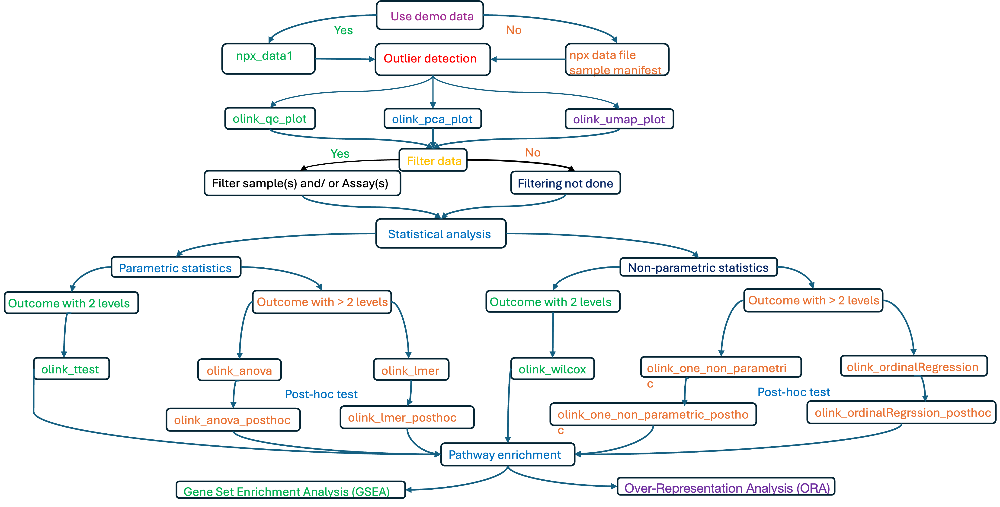

The webserver follows a logical series of tabs that allow researchers to analyze uploaded OLINK data.  
See the figure above for an overview.

**Sections:**

- [**Olink View**](#a-olink-view)
- [**Outlier Detection**](#b-outlier-detection)
- [**Filter Data**](#c-filter-data)
- [**Statistics**](#d-statistics)
- [**Post-hoc Statistics**](#e-post-hoc-statistics)
- [**Pathway Enrichment**](#f-pathway-enrichment)
- [**Additional Visualization**](#g-additional-visualization)

---

## A. Olink View

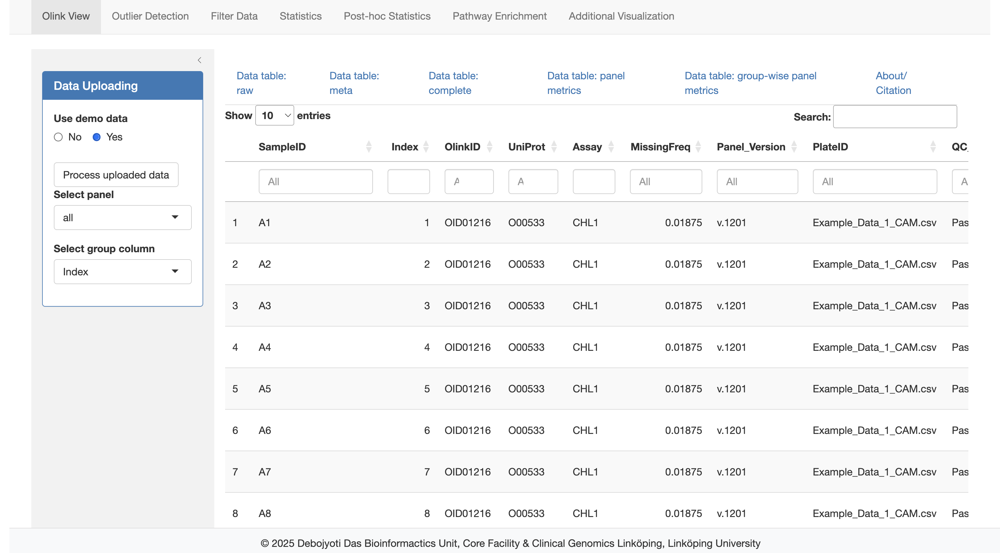  
*Figure: Demo data upload*

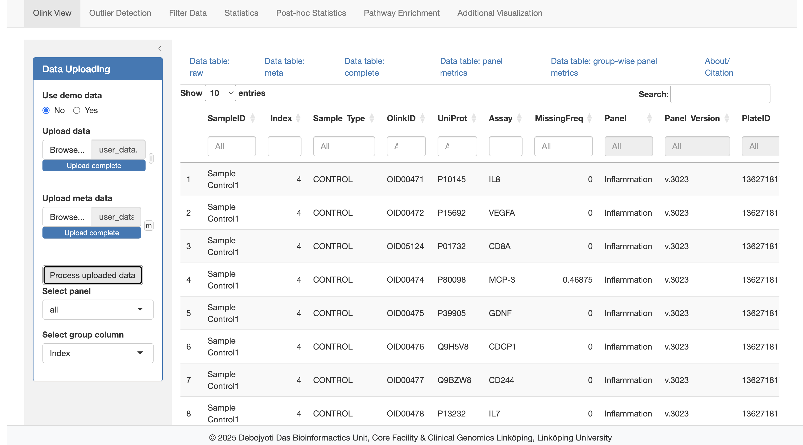  
*Figure: User data upload*

The **Olink View** tab allows data upload. You can optionally use demo data by selecting **"Yes"** for "Use demo data".

You must upload:
- A `.csv` file (uses `;` as a delimiter)
- A sample manifest file (standard CSV format), which contains metadata for each unique `SampleID` in the NPX raw data file.

`SampleID`s must be character strings.

---

## B. Outlier Detection

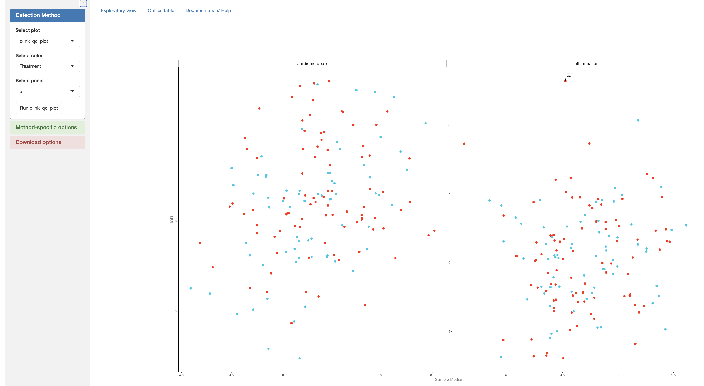  
*Figure: olink_qc_plot and olink_pca_plot*

Three outlier detection methods are available, each with configurable parameters. This step is optional. If performed, outliers from the most recent run are passed to the next step (unless you choose to revert to the original data).

Note: Results from **olink_umap_plot** may vary between runs due to UMAP's stochasticity.

---

## C. Filter Data

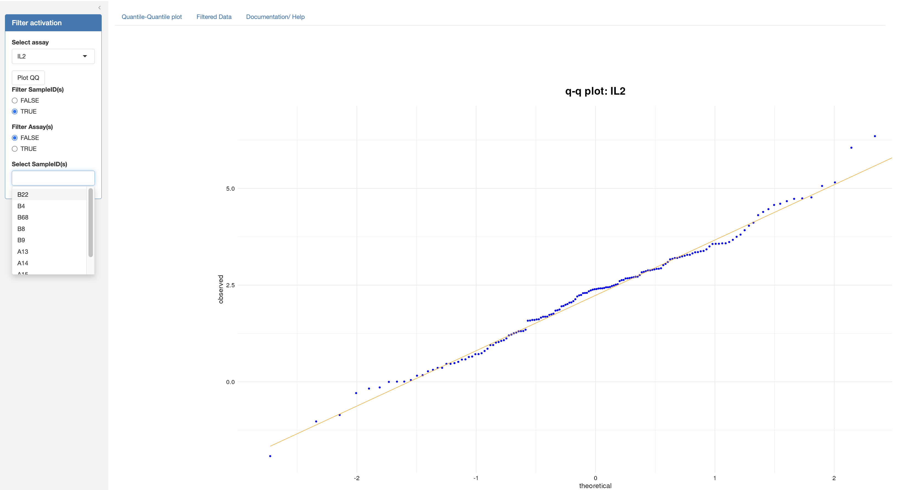  
*Figure: QQ plot of assay distribution*

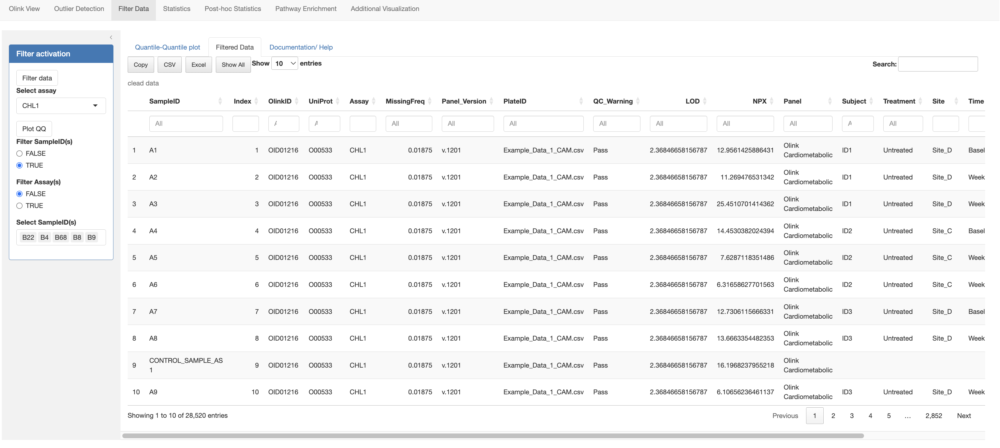  
*Figure: Filtered data output*

You may remove:
- Outlier samples (identified in step B)
- Assays with non-standard distributions

QQ plots help identify deviations from normal distribution.

---

## D. Statistics

### Two-level Outcome Factor

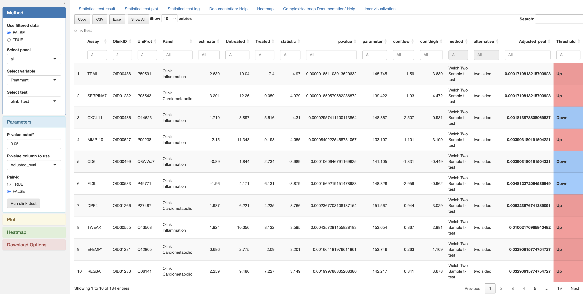  
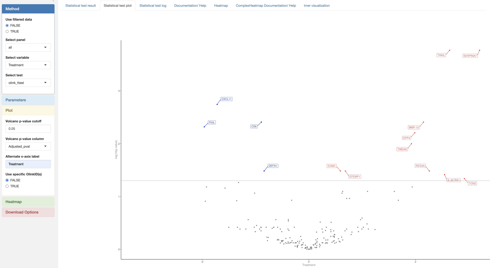  
*Figure: Statistics tab - t-test*

### > Two-level Outcome Factor

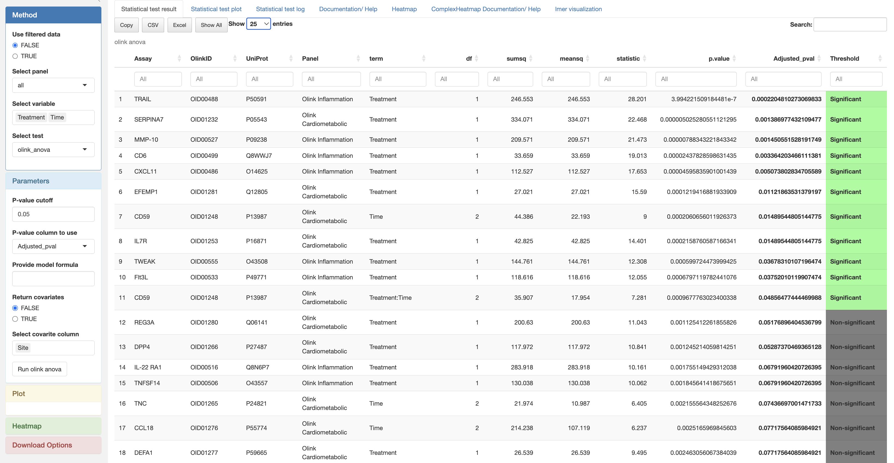  
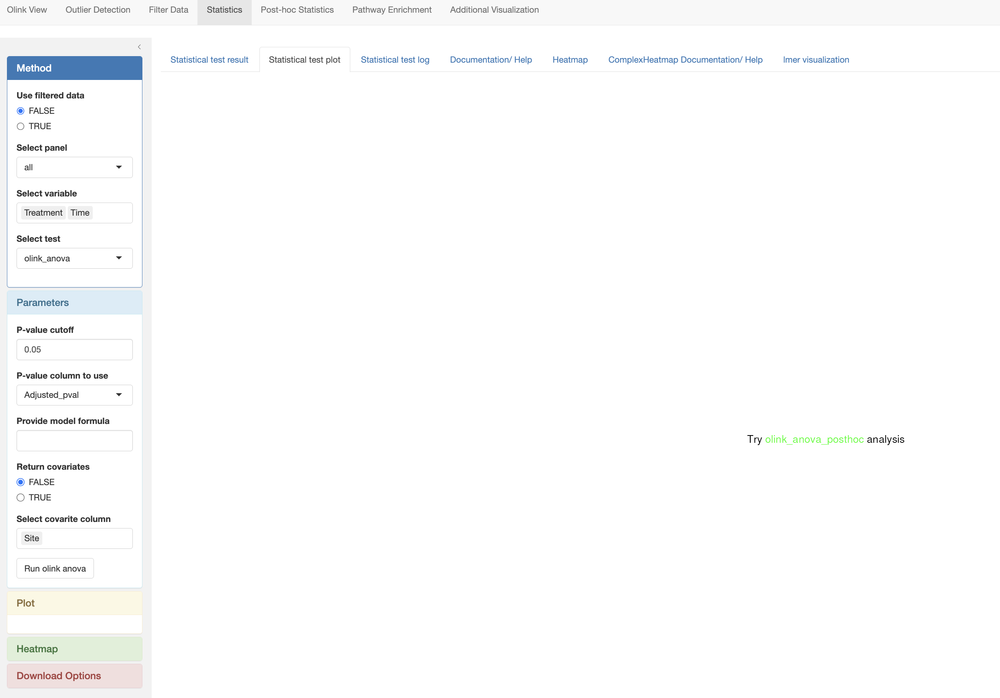  
*Figure: Statistics tab - ANOVA*

Statistical methods:
- **Parametric**: t-test, ANOVA, linear mixed effects (lmer)
- **Non-parametric**: Mann-Whitney U, Kruskal-Wallis, Friedman, ordinal regression

**Heatmaps** can be generated using significant assays and grouped variables.

---

## E. Post-hoc Statistics

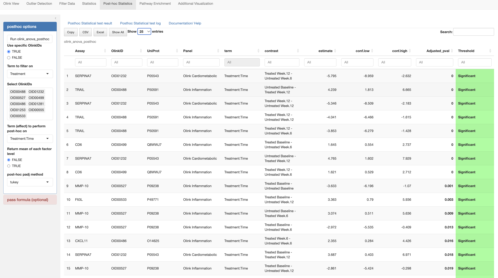  
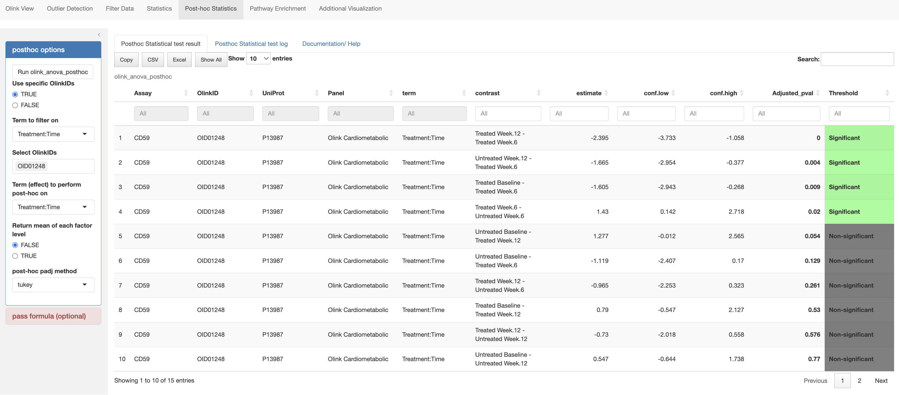  
*Figure: Post-hoc tests*

For tests with >2 outcome levels, post-hoc analysis is required. See the "Documentation/Help" tab for method-specific usage.

---

## F. Pathway Enrichment

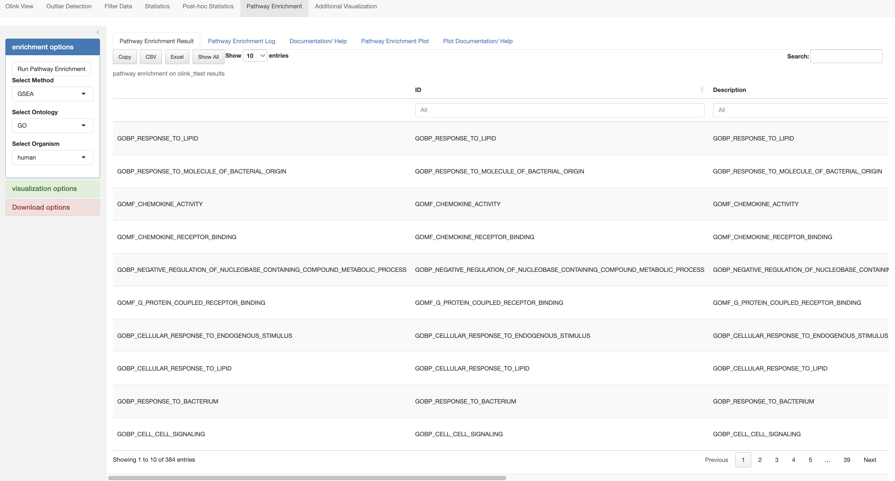  
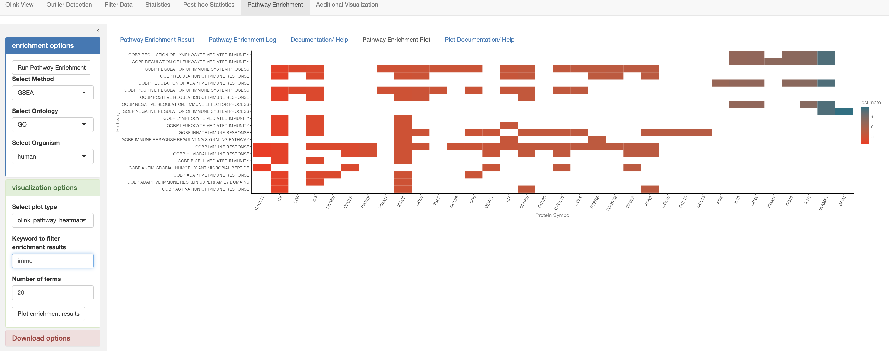  
*Figure: Pathway enrichment results*

After statistical testing, you can run:
- Over-representation analysis (ORA)
- Gene set enrichment analysis (GSEA)

---

## G. Additional Visualization

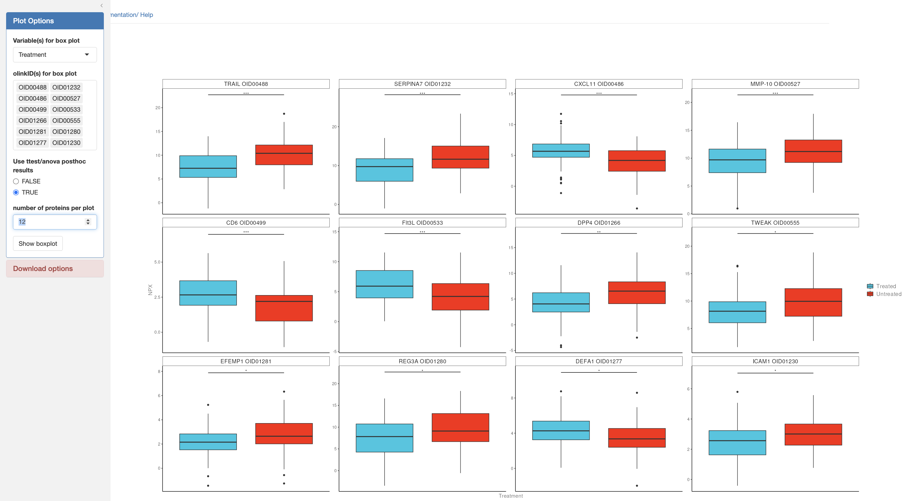  
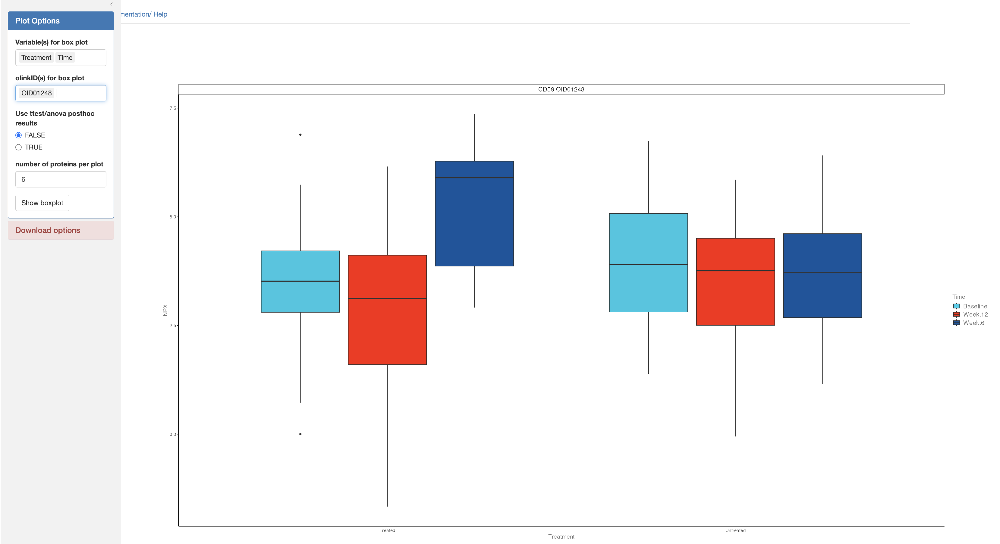  
*Figure: Visualization with significance overlay*

Visualize significant assays using boxplots, with optional p-value annotations.  
Download tables and figures in multiple formats and sizes. -->
